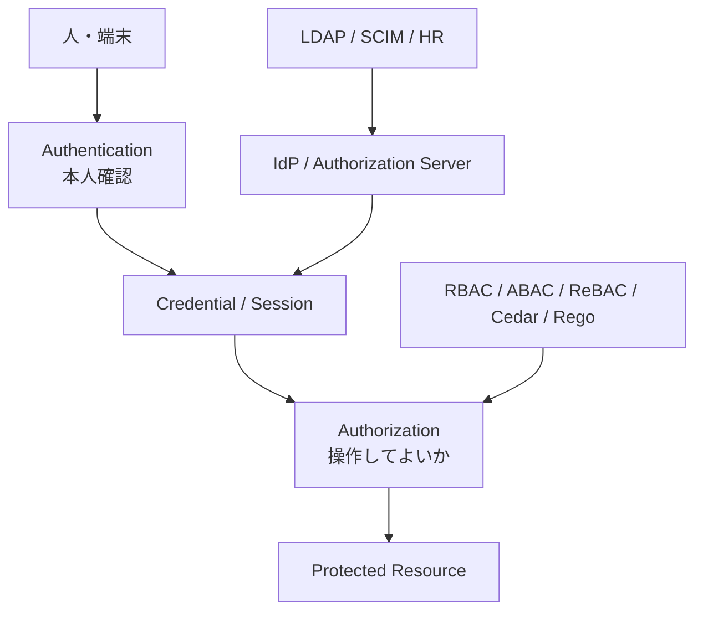

# auth-lab 🔐

[](https://github.com/hjosugi/auth-lab/actions/workflows/ci.yml) [](https://github.com/hjosugi/auth-lab/actions/workflows/pages.yml)

認証・認可を「フレームワークの設定」ではなく、**バイト列・署名・チケット・トークン・
ポリシーの流れ**から理解する、依存パッケージなしの実行可能ラボ。Python 標準ライブラリ
のみ（`pip install` 不要）。

[対話型 Playground（GitHub Pages）](https://hjosugi.github.io/auth-lab/) /
[図集（フロー図）](docs/diagrams.md) /
[14日学習計画](docs/11_14day_plan.md) /
[プロトコル解説](docs/00_index.md) /
[攻撃対応表](docs/09_attack_matrix.md) /
[参考資料](docs/13_references.md) /
[GitHub Issues](https://github.com/hjosugi/auth-lab/issues)

> [!WARNING]
> このリポジトリの暗号・証明書・SAML・Kerberos 実装は、仕組みを一行ずつ読むための
> 教材です。本番で独自暗号や独自 IdP を使わないでください。本番では、保守されている
> 標準ライブラリ、認証基盤、HSM/KMS、適切な鍵ローテーションを使います。純 Python の
> RSA/AES/ECDSA は定数時間ではなくサイドチャネルに脆弱です。SAML は exc-c14n と
> `xmlsec1` 相互検証を学べますが、適合認証済み製品ではありません。目的は「本番で使う」ことではなく
> 「全バイトを読める」ことです。

## ▶ ブラウザで試す

**[playground](https://hjosugi.github.io/auth-lab/)** — JWT デコード/署名/検証、ライブ TOTP
生成、PKCE、パスワードハッシュ、5認可モデル比較、OAuth/SAML/Kerberos/WebAuthnの
日英sequence、`alg=none` 攻撃などを、**ブラウザ内で
本物の暗号処理**（Web Crypto API）で動かせる。インストール不要、通信も一切なし。

> GitHub Pages は `.github/workflows/pages.yml` が `docs/` を自動デプロイする。
> ローカルなら `docs/index.html` を直接開いても動く。

## 何が入っているか

| 領域 | 読める実装 | 重要な検証 |
|---|---|---|
| Password | scrypt / PBKDF2、salt、自己記述形式、pepper | 定数時間比較、ユーザー列挙対策 |
| MFA | HOTP / TOTP、リカバリコード | RFC 4226/6238 ベクタ、時間窓、リプレイ拒否 |
| JOSE | JWS / JWT / JWKS、HS/RS 256/384/512 | alg 固定、`kid`、iss/aud/exp/nbf/jti |
| OAuth 2.0 + Security BCP / OIDC | Code+PKCE、Refresh、Client Credentials、Device | exact redirect、state/nonce、ローテーション+再利用検知 |
| Advanced OAuth / FAPI 2.0 | PAR、JAR、JARM、RAR、CIBA、Security / Message Signing | request/response/token/approvalの署名・client・audience束縛 |
| Proof of possession | DPoP、mTLS（**本物のTLSハンドシェイク**） | 証明書/鍵へのトークン束縛 (RFC 8705/9449) |
| Federation | SAML Web SSO、XML-DSig | 署名対象、audience、ACS、InResponseTo、replay、XSW |
| Enterprise SSO | Kerberos AS/TGS/service | pre-auth、ticket、authenticator、clock skew、4大AD攻撃 |
| Passwordless | WebAuthn / passkeys、COSE | challenge、origin、RP ID、UP/UV、counter |
| Directory | LDAP、SCIM | bind/search escaping、匿名bind対策、provision/deprovision |
| Authorization | RBAC、ABAC、ReBAC、Cedar、Rego | decision parity、tenant/deny、cycle/depth、privacy-safe logs |
| Crypto | RSA、ECDSA(P-256)、AES、CBOR、X.509 CA | FIPS-197 KAT、RFC 8949、`openssl verify` 通過 |

## 5分で動かす

Python 3.11 以上だけで動く。`pip install` は不要。

```bash
python scripts/verify.py             # テスト + ドリル + 攻撃回帰を一括検証
python drills/run_all.py             # 14本のドリルが全部緑になるのを見る
python attacks/run_regressions.py    # 危険な入力がすべて拒否されるのを確認
```

期待結果:

- 自動テストが全件成功する（件数はrunnerが実行時に表示）
- **14 個のドリル**が成功する
- 攻撃カタログの全項目が **DEFENDED** になる

OAuth/OIDC サーバを起動して curl で叩く:

```bash
python -m authlab.server &
curl -s localhost:8080/.well-known/openid-configuration | python3 -m json.tool
curl -s -u service:service-secret \
  -d grant_type=client_credentials -d scope=orders:read localhost:8080/token
```

デバッガで止めながら読む:

```bash
python -m pdb drills/run_all.py
```

## 全体像



認証は「誰か」を確かめ、認可は「何をしてよいか」を判断する。OAuth は認証プロトコルでは
なく委譲認可であり、OIDC が OAuth の上に認証レイヤーを足す。

## リポジトリの歩き方

```text
authlab/       仕組みを最小構成で実装した Python モジュール（依存なし）
  util crypto passwords mfa jose oauth saml kerberos webauthn mtls directory authz
  server.py    curl で叩ける HTTP デモサーバ
tests/         自動検証（正常系・異常系・RFCベクタ）
drills/        14本の実行可能ドリル（run_all.py で一括）
attacks/       よくある設計ミスを拒否できるかの回帰（catalog.py / run_regressions.py）
docs/          図解・日本語解説・Spring対応表・面接スクリプト・ブラウザ Playground(index.html)
spring-companion/ Java 21 / Spring SecurityによるOIDC・resource server・method security写経
scripts/       一括検証(verify.py)と配布ZIP生成(make_zip.py)
```

## 学習の原則

1. まず正常系のバイト列と状態遷移を追う。
2. 何を信頼するか、どこに束縛するかを言葉にする。
3. 署名検証だけで終えず、issuer・audience・time・nonce を検証する。
4. 同じ値を二度使い、リプレイが拒否されることを確認する。
5. 認証後に、別ユーザーのリソースへアクセスできないこと（BOLA）を確認する。
6. 本番ライブラリの設定を、このラボの検証項目へ対応付ける（[Spring 対応表](docs/10_spring_security_map.md)）。

## ドキュメント

- [docs/00_index.md](docs/00_index.md) — 目次
- プロトコル解説（日本語）: [土台](docs/01_foundations.md) · [JOSE·OAuth·OIDC](docs/02_jose_oauth_oidc.md) ·
  [SAML](docs/03_saml.md) · [Kerberos](docs/04_kerberos.md) · [WebAuthn](docs/05_webauthn.md) ·
  [mTLS·DPoP](docs/06_mtls_dpop.md) · [LDAP·SCIM](docs/07_ldap_scim.md) · [認可モデル](docs/08_authz.md)
  · [高度なOAuth·FAPI 2.0](docs/14_advanced_oauth_fapi.md)
- [攻撃対応表（CWE/OWASP）](docs/09_attack_matrix.md) · [Spring Security 対応表](docs/10_spring_security_map.md)
- [Java 21 / Spring Security companion](spring-companion/README.md) — OIDC、JWT/opaque、method security、脅威モデル
- [14日ドリル計画](docs/11_14day_plan.md) · [面接用スクリプト（英語）](docs/12_interview_english.md) · [参考サイト・仕様一覧](docs/13_references.md)

## ライセンス

MIT
