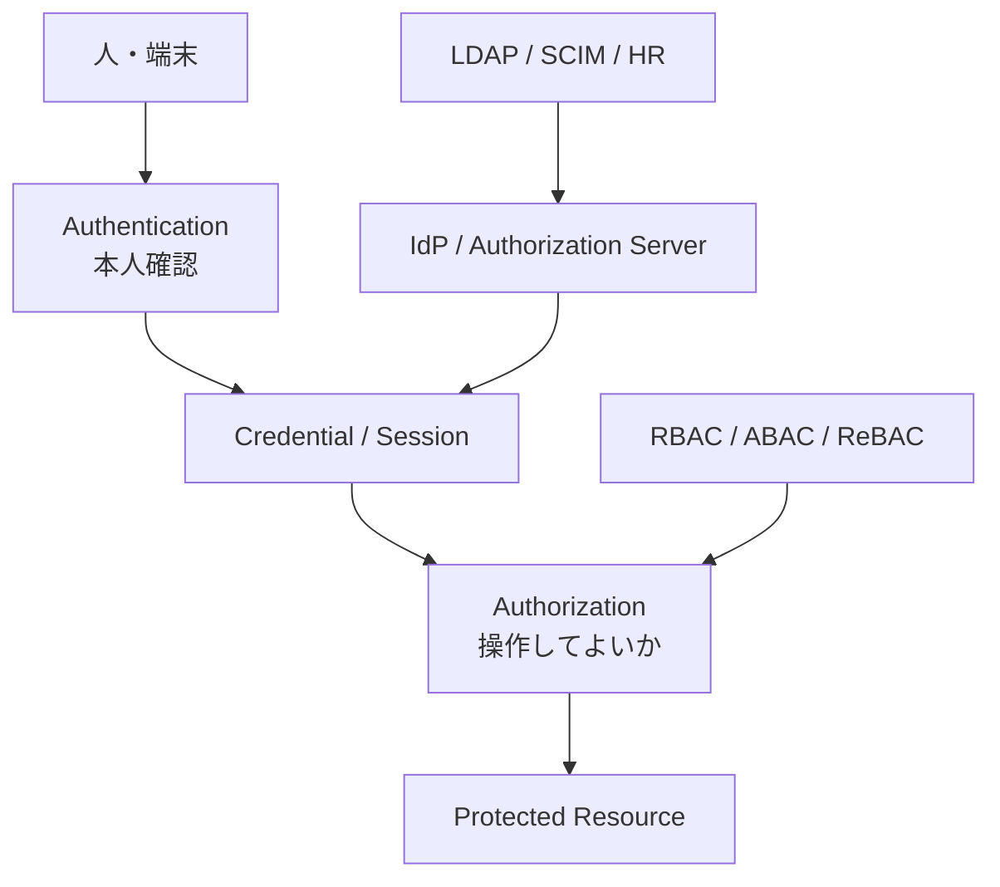

# auth-lab

[](https://github.com/hjosugi/auth-lab/actions/workflows/ci.yml)
[](https://github.com/hjosugi/auth-lab/actions/workflows/pages.yml)

認証・認可を「フレームワークの設定」ではなく、バイト列、署名、チケット、
トークン、ポリシーの流れから理解する、依存パッケージなしの実行可能ラボです。

[GitHub Pages の対話型 Playground](https://hjosugi.github.io/auth-lab/) /
[14日学習計画](docs/14-day-plan.md) /
[プロトコル地図](docs/protocols.md) /
[攻撃と防御](docs/attack-matrix.md) /
[公式資料](docs/references.md)

> [!WARNING]
> このリポジトリの暗号・証明書・SAML・Kerberos実装は、仕組みを一行ずつ読むための
> 教材です。本番で独自暗号や独自IdPを使わないでください。本番では、保守されている
> 標準ライブラリ、認証基盤、HSM/KMS、適切な鍵ローテーションを使います。

## 何が入っているか

| 領域 | 読める実装 | 重要な検証 |
|---|---|---|
| Password | scrypt / PBKDF2、salt、自己記述形式 | 定数時間比較、ユーザー列挙対策 |
| MFA | HOTP / TOTP | RFCベクタ、時間窓、リプレイ拒否 |
| JOSE | JWS / JWT / JWKS、HS256 / RS256 | alg固定、`kid`、iss/aud/exp/nbf/jti |
| OAuth/OIDC | Code+PKCE、Refresh、Client Credentials、Device | exact redirect、state/nonce、ローテーション |
| Federation | SAML Web SSO | 署名対象、audience、ACS、InResponseTo、replay |
| Enterprise SSO | Kerberos AS/TGS/service | pre-auth、ticket、authenticator、clock skew |
| Passwordless | WebAuthn/passkeys | challenge、origin、RP ID、UP/UV、counter |
| Proof of possession | mTLS、DPoP | 証明書/鍵へのトークン束縛 |
| Directory | LDAP、SCIM | bind/search escaping、provision/deprovision、ETag |
| Authorization | RBAC、ABAC、ReBAC | role継承、deny-overrides、userset rewrite |
| HTTP | Basic、Bearer、HMAC署名 | canonical request、timestamp、nonce |

## 5分で動かす

Python 3.11以上だけで動きます。`pip install` は不要です。

```bash
python scripts/verify.py
python drills/run_all.py
python attacks/run_regressions.py
```

期待結果:

- 自動テスト 22件が成功する
- 14個のドリルが成功する
- 7個の危険な入力がすべて拒否される

デバッガで止めながら読む場合:

```bash
python -m pdb drills/run_all.py
```

## 全体像



認証は「誰か」を確かめ、認可は「何をしてよいか」を判断します。OAuthは認証
プロトコルではなく委譲認可です。OIDCがOAuthの上に認証レイヤーを追加します。

## リポジトリの歩き方

```text
authlab/       仕組みを最小構成で実装したPythonモジュール
tests/         正常系・異常系の自動検証
drills/        14日分の実行可能ドリル
attacks/       よくある設計ミスを拒否できるかの回帰テスト
docs/          図解、比較、Spring対応表、面接スクリプト
site/          GitHub Pagesで動くブラウザPlayground
scripts/       一括検証とZIP生成
```

## 学習の原則

1. まず正常系のバイト列と状態遷移を追う。
2. 何を信頼するか、どこに束縛するかを言葉にする。
3. 署名検証だけで終えず、issuer、audience、time、nonceを検証する。
4. 同じ値を二度使い、リプレイが拒否されることを確認する。
5. 認証後に、別ユーザーのリソースへアクセスできないことを確認する。
6. 本番ライブラリの設定を、このラボの検証項目へ対応付ける。

## ライセンス

MIT
