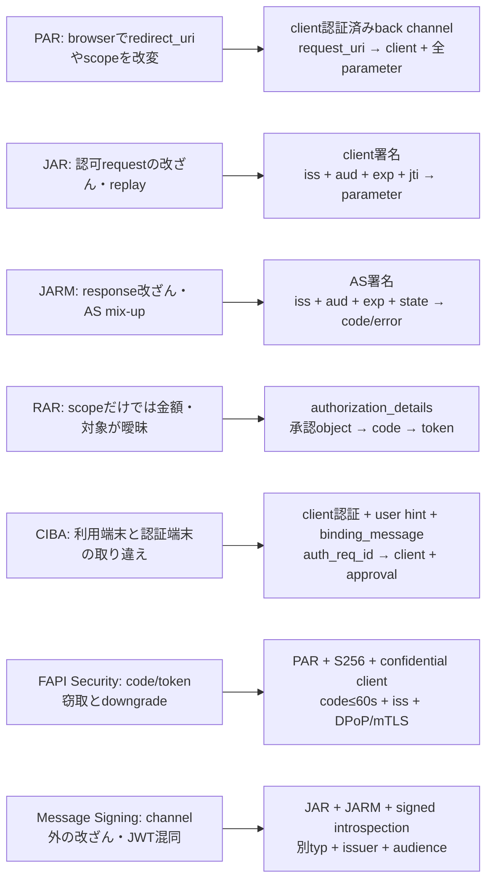
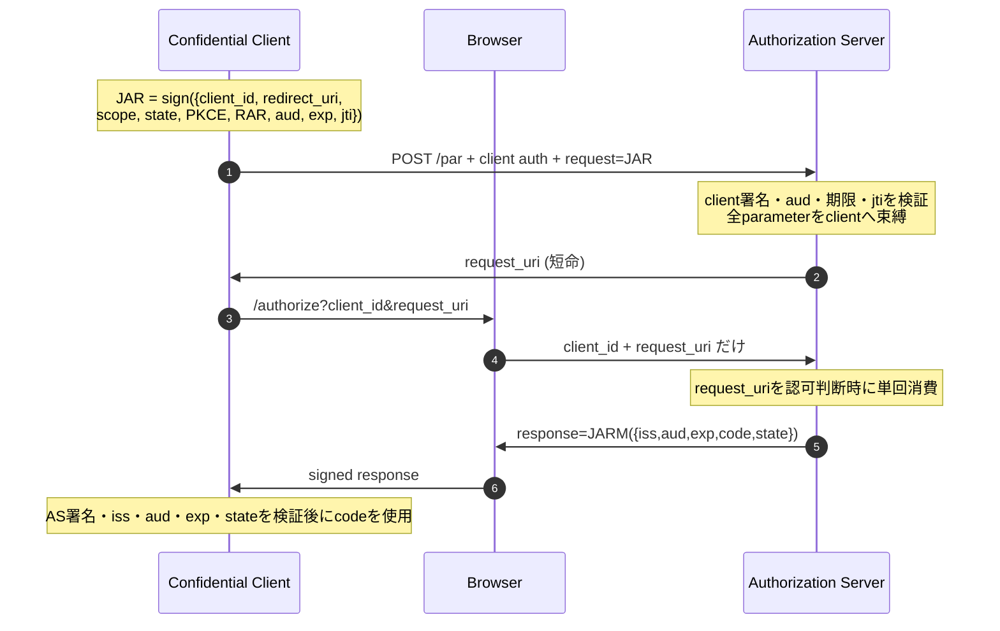
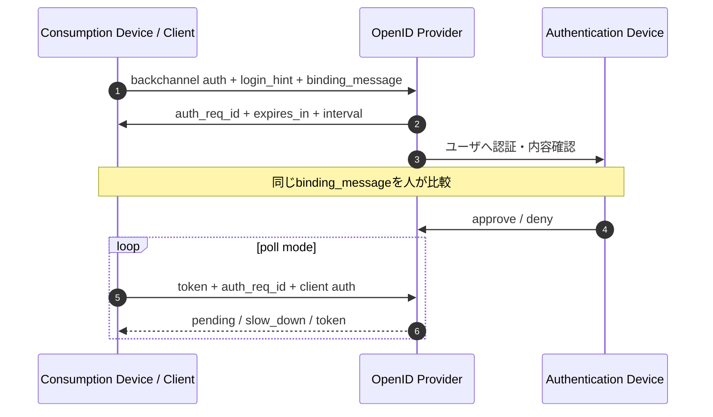
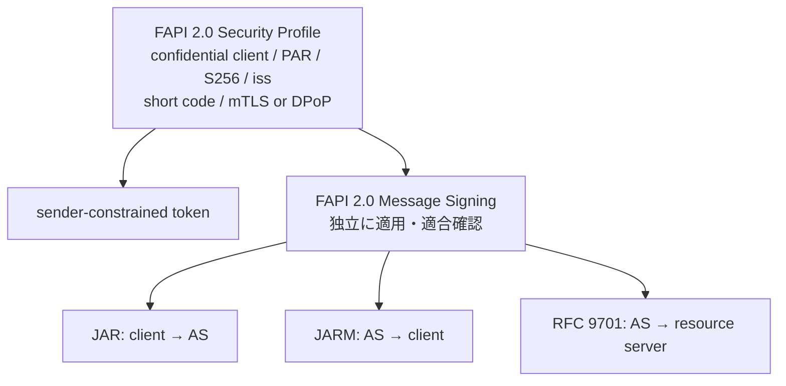

# 高度な OAuth: PAR / JAR / JARM / RAR / CIBA / FAPI 2.0

OAuth の基本フローが安全でも、高価値 API では「ブラウザでパラメータを書き換える」
「認可応答を別フローへ差し替える」「Bearer token を盗んで再利用する」といった
追加の攻撃モデルが残る。この章では、各仕様が**何を何へ束縛するか**を追う。

このラボは仕様の境界と状態を読めるようにした教材であり、FAPI 適合認証を受けた製品
ではない。TLS 配備、鍵管理、暗号スイート、HTTP status、エコシステム固有 policy まで
含む完全な適合性確認には、公式 conformance suite と本番向け実装を使うこと。

## 仕様の状態

- PAR、JAR、RAR と signed introspection はそれぞれ RFC 9126、9101、9396、9701。
- JARM と CIBA Core 1.0 は OpenID Foundation の Final Specification。
- FAPI 2.0 Security Profile は 2025年2月、Message Signing は 2025年9月の Final。
- **OAuth 2.1 は現在も Internet-Draft**。このラボが code + PKCE を採用していても、
  OAuth 2.1 全体を「確定済み RFC」とは呼ばない。

## 脅威モデルと追加 binding



| Profile | 攻撃者が変えたいもの | 追加される検証 |
|---|---|---|
| PAR | browser 上の `redirect_uri`、scope、RAR | PAR endpoint で client 認証し、短命 `request_uri` へ全体を束縛 |
| JAR | request parameter、AS 宛先、再利用時刻 | client 署名、`iss/client_id`、`aud`、`nbf/exp`、単回 `jti` |
| JARM | `code`/`error`/`state`、発行 AS | AS 署名、`iss`、`aud=client_id`、`exp`、`state`、単回 `jti` |
| RAR | 金額、対象口座、許可 action | schema と type allow-list を検証し、承認 object を code/token/introspection へ継承 |
| CIBA | user hint、別 client の `auth_req_id`、poll replay | client 認証、hint 1個、client binding、期限、interval、単回使用 |
| FAPI Security | public/shared-secret client、Bearer replay、長寿命 code | asymmetric client 認証、PAR、S256、60秒 code、`iss`、mTLS/DPoP |
| FAPI Message Signing | request/response/introspection の改ざん・JWT 型混同 | JAR、JARM、RFC 9701 の専用 `typ` と `token_introspection` claim |

## PAR + JAR + JARM



PAR は値を隠す仕組みではない。目的は、browser に渡す前に**認証済み client と request
全体を結び付ける**こと。JAR は request 自体の完全性、JARM は response の完全性と
発行元を追加する。3つは役割が重なるように見えても、守る区間が違う。

実装:

- `authlab/oauth/par.py`
- `authlab/oauth/jar.py`
- `authlab/oauth/jarm.py`

## RAR: scope から構造化された意図へ

`scope=payments` だけでは、「JPY 1,250 をどの宛先へ送るか」を表せない。
RAR は `authorization_details` を JSON object の配列として運ぶ。

```json
[
  {
    "type": "payment_initiation",
    "actions": ["initiate"],
    "instructedAmount": {"currency": "JPY", "amount": "1250"}
  }
]
```

このラボは共通 field と HTTPS `locations`、明示した `type` allow-list を検証する。
業務固有 field の schema は各 API が所有する。承認済み object は
`AuthorizationCode.authorization_details` から access/refresh token と introspection
へコピーされるため、token endpoint で別の金額へ差し替えられない。

実装: `authlab/oauth/rar.py`, `authlab/oauth/authorization_server.py`

## CIBA: 利用端末と認証端末を分離する



`poll`、`ping`、`push` を状態として分ける。教材は外部 URL へ通信せず、ping/push の
送信内容を envelope として返す。これにより実 credential や外部 endpoint を使わずに、
notification token、client binding、単回使用を観察できる。

実装: `authlab/oauth/ciba.py`

## FAPI 2.0: Security と Message Signing を混ぜない



`FAPI2SecurityProfile` は次を拒否する。

- public client または shared-secret client
- mTLS/DPoP のどちらにも束縛されない access token
- PAR を経由しない認可、S256 以外、`redirect_uri` 欠如
- 60秒を超える authorization code
- 通常運用での AS-side refresh token rotation

`FAPI2MessageSigning` は別クラスで、Security Profile に JAR/JARM/signed introspection
を合成する。RFC 9701 response は `typ=token-introspection+jwt` を必須にし、通常の
access token と同じ top-level に `sub` や `scope` を置かず、
`token_introspection` claim の内側へ隔離する。

この教材の Message Signing は既存 JOSE 学習経路との接続を優先して RS256 を使う。
FAPI 2.0 の本番暗号 profile（PS256、ES256、EdDSA、RSA 2048 bit 以上）を満たすという
主張ではない。チャネル binding、claim validation、profile 分離を学ぶ実行可能 subset
である。

実装:

- `authlab/oauth/fapi2_security.py`
- `authlab/oauth/fapi2_message_signing.py`

## 実行して確認

```bash
python drills/14_advanced_oauth.py
python -m unittest tests.test_oauth_advanced
python attacks/run_regressions.py
```

各 profile に正常系と最低1つの negative test がある。代表的な拒否は、PAR の
front-channel parameter 注入、JAR 署名改ざん、JARM state 差し替え、未対応 RAR type、
CIBA 未承認 poll、FAPI public client、signed introspection の audience 不一致。
