# 図集（プロトコル・フロー図）

全プロトコルのシーケンス図・構造図。GitHub 上でそのまま描画される（Mermaid）。
ブラウザ Playground の「Diagrams」タブでも見られる。

- [全体像](#全体像)
- [JWT の構造](#jwt-の構造)
- [OAuth 2.0 Security BCP: 認可コード + PKCE](#oauth-20-security-bcp-認可コード--pkce)
- [リフレッシュトークン ローテーション + 再利用検知](#リフレッシュトークン-ローテーション--再利用検知)
- [OIDC: ID トークン vs アクセストークン](#oidc-id-トークン-vs-アクセストークン)
- [デバイスフロー](#デバイスフロー-rfc-8628)
- [DPoP 送信者制約](#dpop-送信者制約-rfc-9449)
- [mTLS ハンドシェイク](#mtls-ハンドシェイク)
- [SAML Web SSO](#saml-web-sso)
- [XML 署名ラッピング (XSW)](#xml-署名ラッピング-xsw)
- [Kerberos AS/TGS/AP](#kerberos-astgsap)
- [WebAuthn 登録](#webauthn-登録)
- [WebAuthn 認証](#webauthn-認証)
- [リソースサーバの8ステップ](#リソースサーバの8ステップ)
- [認可モデル RBAC/ABAC/ReBAC](#認可モデル-rbacabacrebac)

---

## 全体像

認証は「誰か」、認可は「何をしてよいか」。OAuth は委譲認可、OIDC がその上に認証を足す。

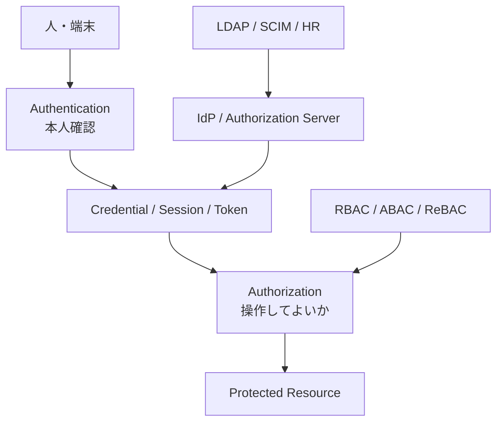

---

## JWT の構造

3つの base64url をドットで繋ぐ。署名対象は先頭2セグメントのテキスト。

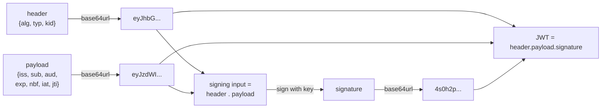

検証時: 受信した `header.payload` のテキストをそのまま検証する（再シリアライズ禁止）。

---

## OAuth 2.0 Security BCP: 認可コード + PKCE

一番の山場。verifier はクライアントに留まり、challenge（そのSHA-256）だけがブラウザを通る。

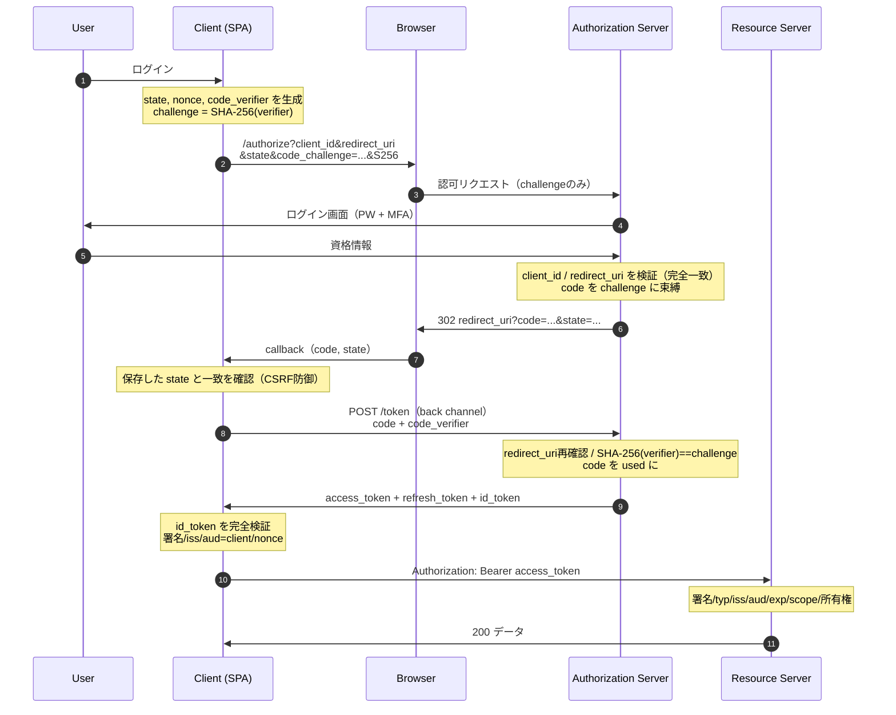

---

## リフレッシュトークン ローテーション + 再利用検知

漏洩したトークンの再提示を検知し、family ごと失効する。

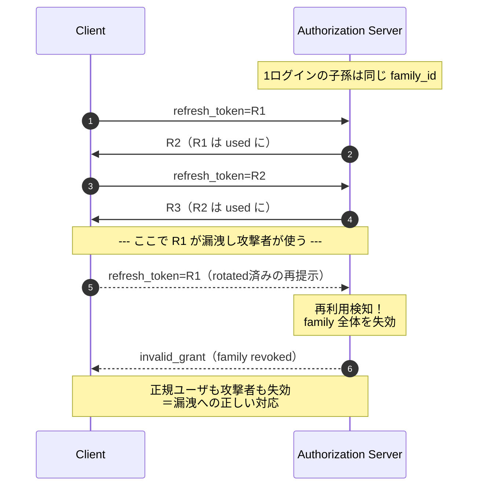

---

## OIDC: ID トークン vs アクセストークン

`aud` が別。ID トークンを API に投げると RS が typ/aud で拒否する。

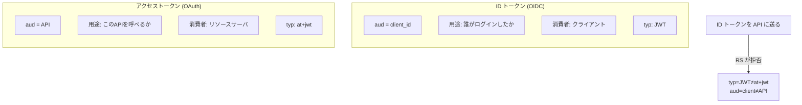

---

## デバイスフロー (RFC 8628)

TV/CLI 用。別デバイス（スマホ）で承認する。

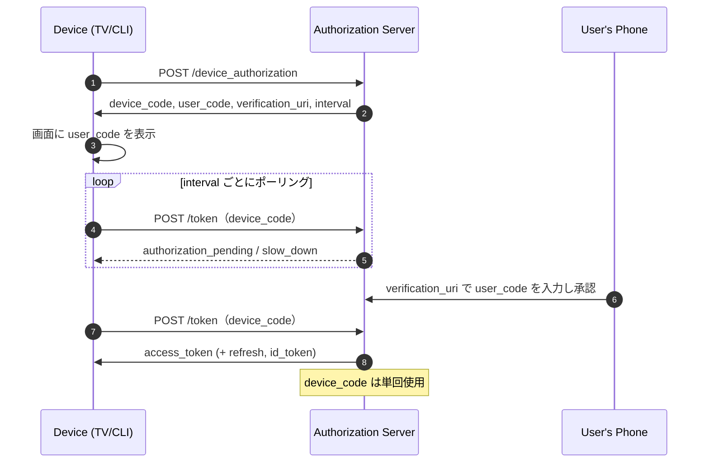

---

## DPoP 送信者制約 (RFC 9449)

トークンを鍵に束縛。盗んだトークンは秘密鍵なしでは無価値。

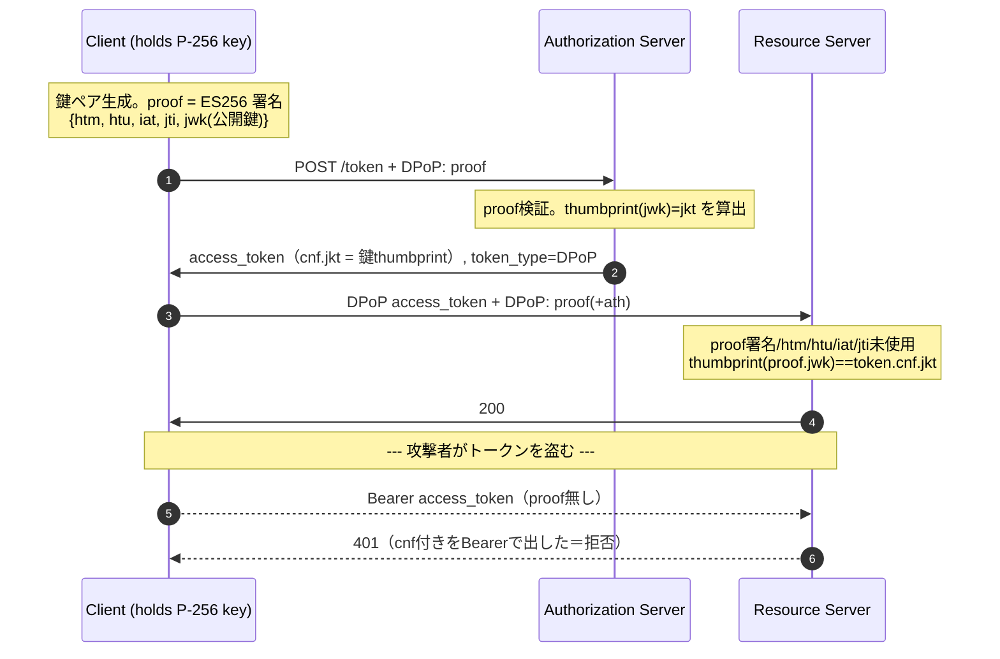

---

## mTLS ハンドシェイク

クライアント認証を TLS ハンドシェイクの中に移す。CERT_REQUIRED。

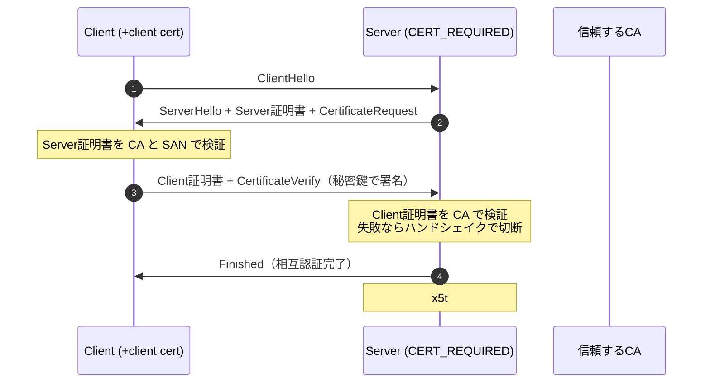

---

## SAML Web SSO

OIDC と同じ形。SP が9項目を検証する。

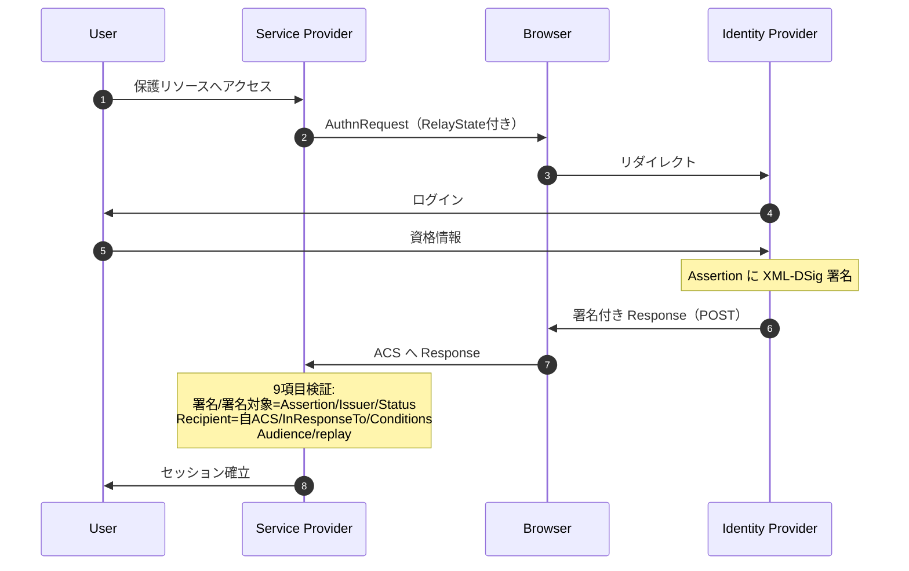

---

## XML 署名ラッピング (XSW)

「署名された要素を返す」API で構造的に防ぐ。

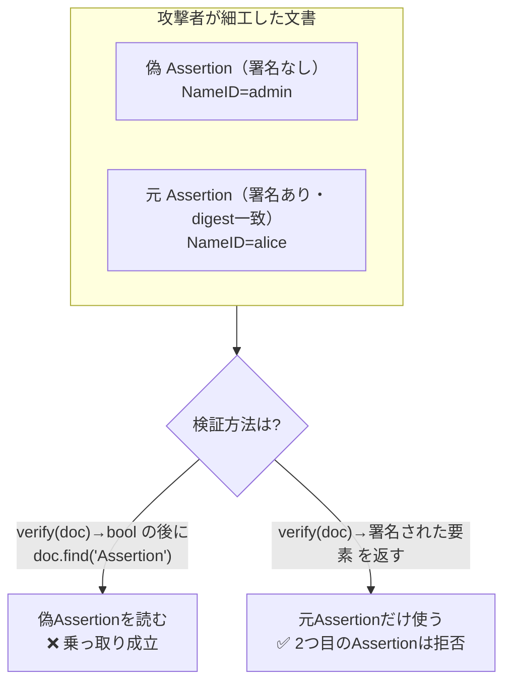

---

## Kerberos AS/TGS/AP

パスワードは kinit の一度だけ。以後はチケット。

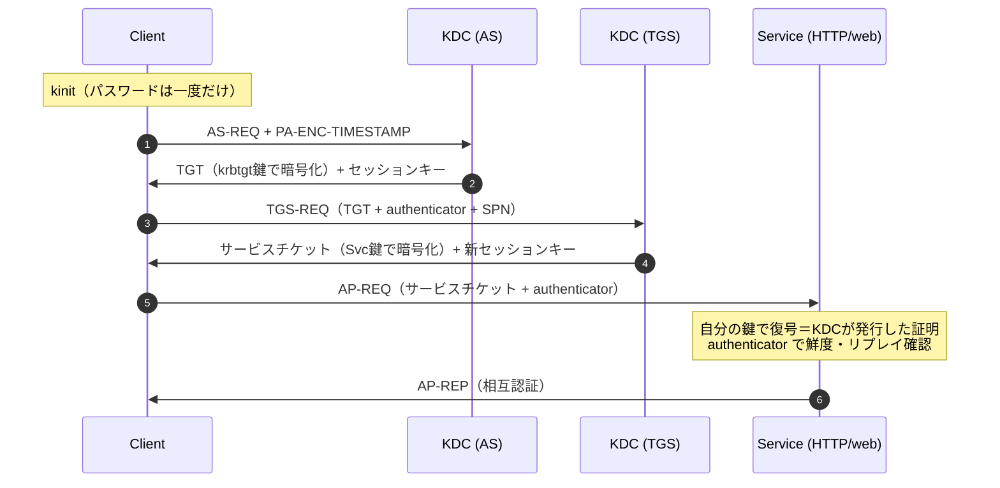

golden ticket は krbtgt 鍵で TGT を偽造、Kerberoasting はサービスチケットをオフラインで割る。

---

## WebAuthn 登録

認証器が鍵ペアを作り、RP は**公開鍵だけ**を保存する。

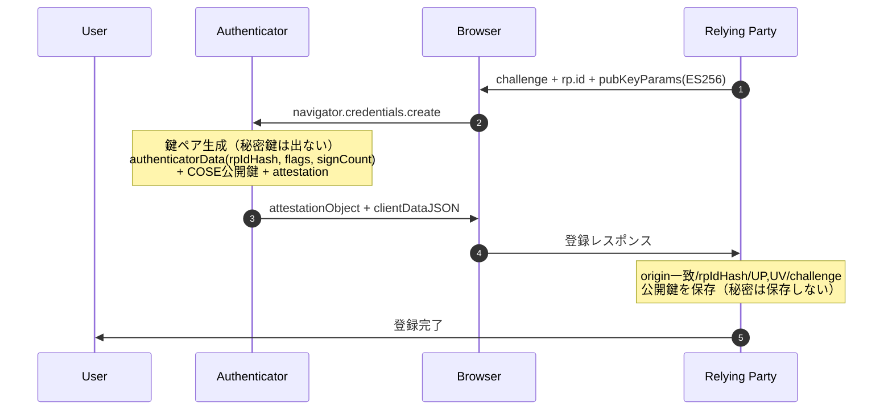

---

## WebAuthn 認証

署名がオリジンに束縛される＝フィッシング耐性。

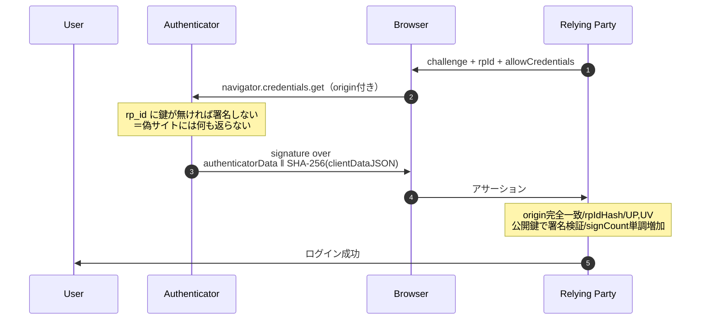

---

## リソースサーバの8ステップ

「valid token ≠ authorized」。8がBOLA。

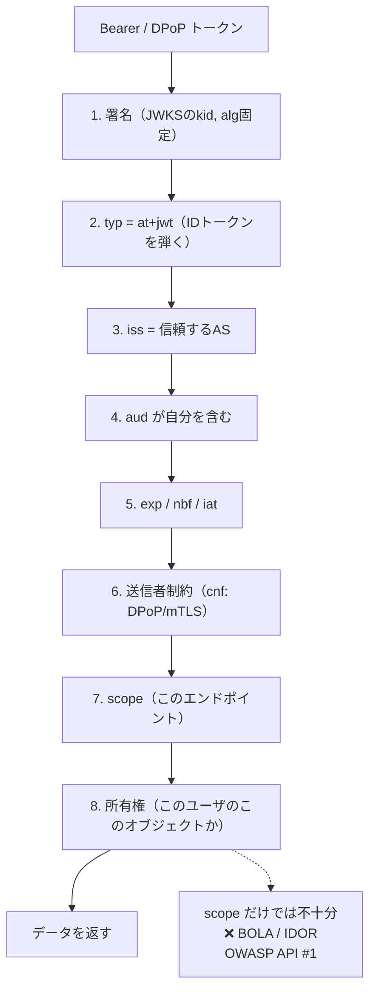

---

## 認可モデル RBAC/ABAC/ReBAC

表現力の弱い順。要件に「自分の」が出たら RBAC では不可。

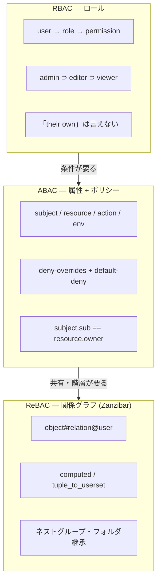

ReBAC の check の例（alice がフォルダ継承経由で文書を閲覧）:

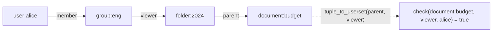
