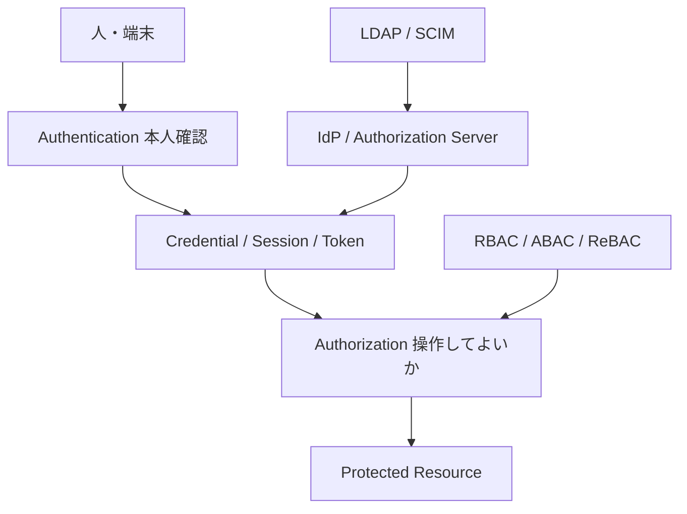

# プロトコル地図

各プロトコルの詳細解説は番号付きファイルにある。ここは索引。

| プロトコル | 解説 | 実装 | ドリル |
|-----------|------|------|--------|
| パスワード・MFA・セッション | [01_foundations.md](01_foundations.md) | `authlab/passwords/`, `authlab/mfa/` | 01, 02 |
| JOSE / OAuth 2.1 / OIDC | [02_jose_oauth_oidc.md](02_jose_oauth_oidc.md) | `authlab/jose/`, `authlab/oauth/` | 03–07 |
| SAML 2.0 | [03_saml.md](03_saml.md) | `authlab/saml/` | 09 |
| Kerberos | [04_kerberos.md](04_kerberos.md) | `authlab/kerberos/` | 10 |
| WebAuthn / passkeys | [05_webauthn.md](05_webauthn.md) | `authlab/webauthn/` | 11 |
| mTLS / DPoP | [06_mtls_dpop.md](06_mtls_dpop.md) | `authlab/mtls/`, `authlab/oauth/dpop.py` | 12, 07 |
| LDAP / SCIM | [07_ldap_scim.md](07_ldap_scim.md) | `authlab/directory/` | 13 |
| RBAC / ABAC / ReBAC | [08_authz.md](08_authz.md) | `authlab/authz/` | 08 |

## 認証と認可の全体像

全体の目次は [00_index.md](00_index.md)。
