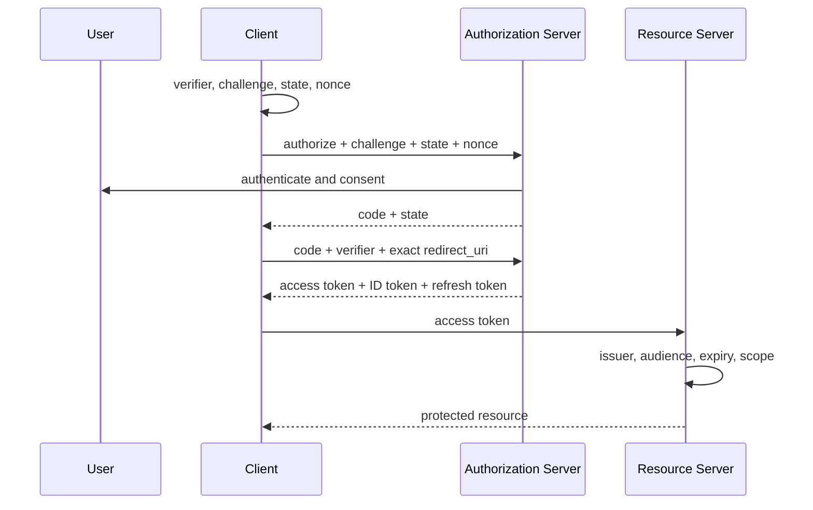
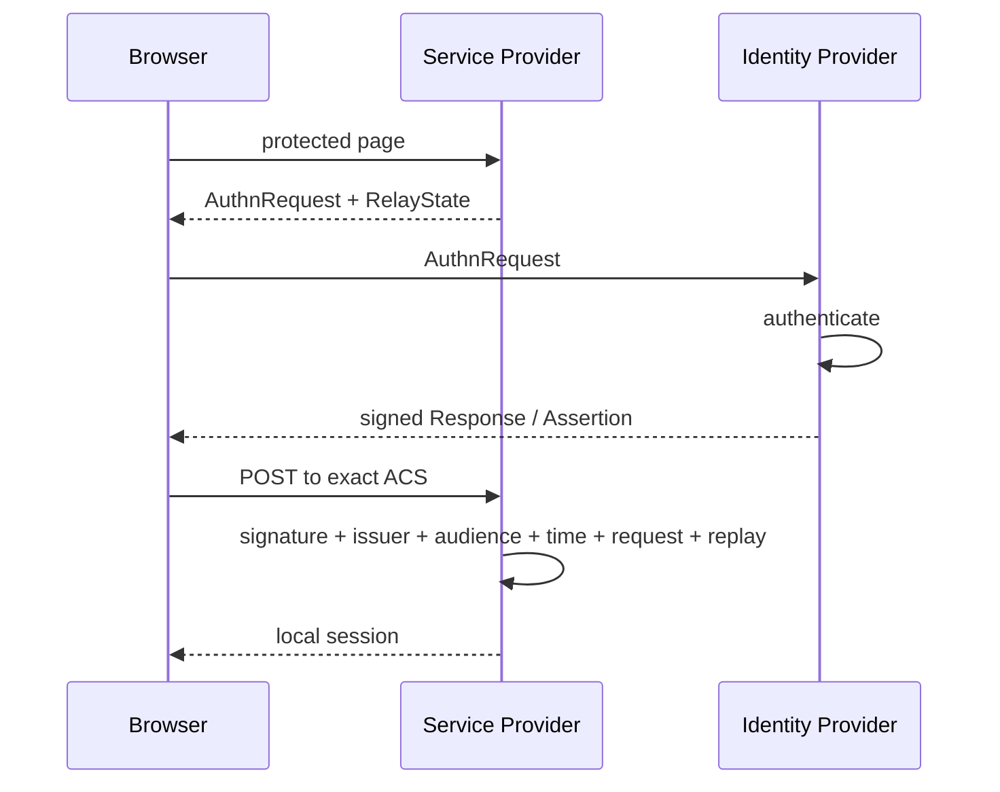
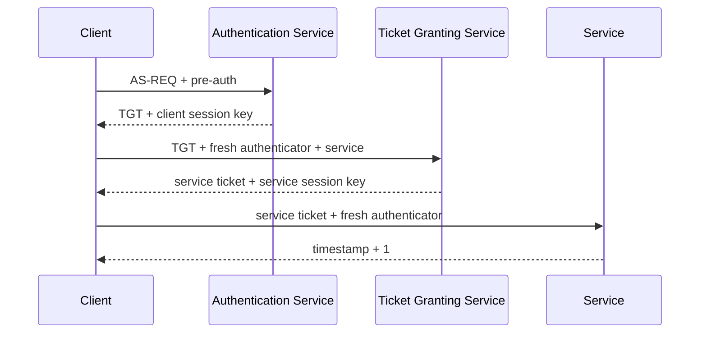
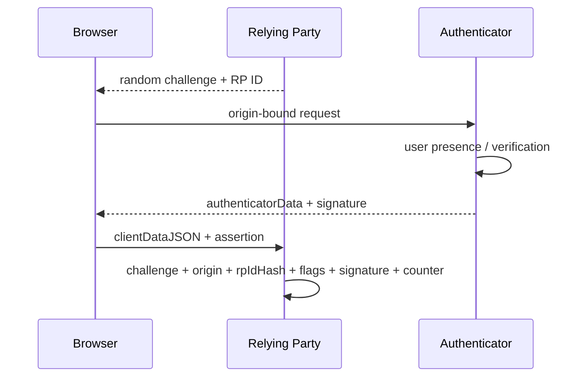

# 認証・認可プロトコル地図

## まず分類する

| 分類 | 目的 | 代表例 | 受け取った側が必ず見るもの |
|---|---|---|---|
| Credential validation | 本人の秘密・鍵を確かめる | Password、TOTP、WebAuthn | hash/signature、freshness、binding |
| Session | 認証状態を継続する | Cookie、session ID | Secure/HttpOnly/SameSite、rotation |
| Delegation | API権限を委譲する | OAuth 2.0 | client、redirect、scope、audience、PKCE |
| Identity federation | IdPの認証結果を渡す | OIDC、SAML | issuer、audience、nonce/request、time、signature |
| Enterprise SSO | 組織内サービスへSSO | Kerberos | realm、service principal、ticket、authenticator |
| Provisioning/directory | アカウントを同期・検索する | LDAP、SCIM | bind権限、filter、schema、version、deprovision |
| Authorization decision | 操作を許可・拒否する | RBAC、ABAC、ReBAC | subject、action、resource、context、default deny |
| Proof of possession | トークン窃取だけでは使えなくする | mTLS、DPoP | certificate/key thumbprint、request binding |

## OAuth 2.0 Authorization Code + PKCE + OIDC

束縛関係が本体です。

- `state`: ブラウザで始めた要求とcallbackを束縛する。
- PKCE: 認可要求とtoken交換を、秘密の`verifier`で束縛する。
- exact `redirect_uri`: codeの配送先を登録済みURIへ束縛する。
- `nonce`: OIDC認証要求とID Tokenを束縛する。
- `aud`: tokenを使ってよい相手へ束縛する。
- `iss`: tokenを発行した信頼ドメインへ束縛する。

`authlab/oauth.py`は、codeの一回性、refresh token rotation、reuse detection、
device pollingの`authorization_pending`と`slow_down`、introspection、revocationを
状態ごと読めるようにしています。

## OIDCのID TokenとOAuth Access Token

| | ID Token | Access Token |
|---|---|---|
| 読み手 | Client | Resource Server |
| 目的 | 認証イベントをClientへ伝える | API権限を行使する |
| 代表audience | `client_id` | API識別子 |
| APIに送るか | 送らない | 送る |
| 重要claim | iss, sub, aud, exp, iat, nonce, amr | iss, sub/client, aud, exp, scope |

ID TokenをAPIへ投げて通るなら、API側のaudience/type検証が壊れています。

## SAML 2.0 Web Browser SSO

XML署名は「XML全体を検証した」では不十分です。アプリが参照するAssertionと、
署名検証したAssertionが同一である必要があります。このラボは、直下のAssertionが
ちょうど1つ、署名対象フィールドが明示的、DTD/ENTITY禁止、ID再利用禁止という
順序を見せます。本番では検証済みSAMLライブラリとメタデータ管理を使います。

## Kerberos

パスワードは各サービスへ送られません。KDCがticketを発行し、短寿命の
authenticatorがリプレイを防ぎます。service principal、realm、DNS、時刻同期、
KDC保護が運用上の要点です。

## WebAuthn / Passkeys

サーバーは秘密鍵を持ちません。フィッシング耐性は、ブラウザがorigin/RP IDを
authenticatorの署名対象へ束縛することで生まれます。`authlab/webauthn.py`は
P-256署名まで標準ライブラリだけで追える教材です。

## mTLS と DPoP

Bearer tokenは「持っている者」が使えます。Proof-of-possessionは、tokenへ
公開鍵のthumbprintを入れ、リクエスト時の秘密鍵所持も証明します。

| | mTLS | DPoP |
|---|---|---|
| 証明場所 | TLS handshake | HTTP headerのJWS |
| token binding | `cnf.x5t#S256` | `cnf.jkt` |
| request binding | TLS接続/証明書 | htm, htu, iat, jti, ath, nonce |
| 主な用途 | 高保証B2B/FAPI、サービス間 | public clientを含むアプリ層PoP |

## LDAP と SCIM

LDAPはディレクトリへの検索・更新・bindのプロトコルです。SCIMはHTTP/JSONで
ユーザーとグループのprovisioning lifecycleを同期します。

- LDAP filterへ文字列連結しない。RFCのエスケープまたは安全なAPIを使う。
- anonymous bindを必要なく許可しない。LDAP over TLSを使う。
- SCIM PATCHはschema、許可path、型を検証する。
- `If-Match`/ETagでlost updateを防ぐ。
- 退職・権限変更時のdeprovisionを最優先で検証する。

## RBAC / ABAC / ReBAC

| モデル | 判断材料 | 得意 | 注意点 |
|---|---|---|---|
| RBAC | user → role → permission | 組織職務、監査 | role explosion、継承の可視化 |
| ABAC | subject/resource/context属性 | 条件付き判断 | 属性の信頼元、deny優先 |
| ReBAC | subject-resourceの関係 | 共有、階層、SNS | cycle/depth、一貫性、list_objects |

認証済みであることは認可済みを意味しません。すべてのobject accessで
`subject + action + resource + context`を評価し、デフォルト拒否にします。

